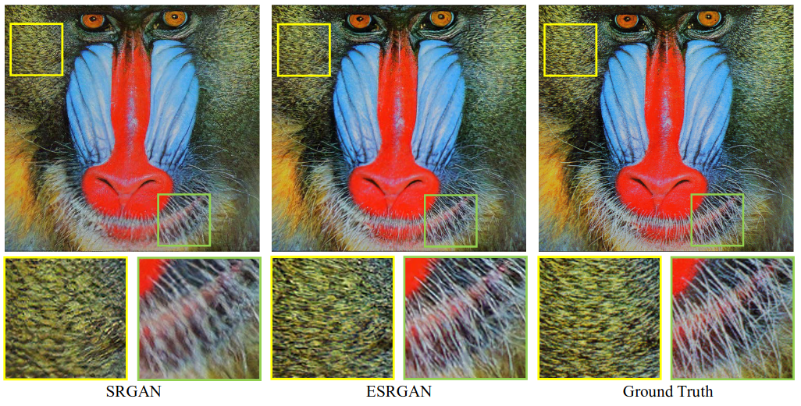
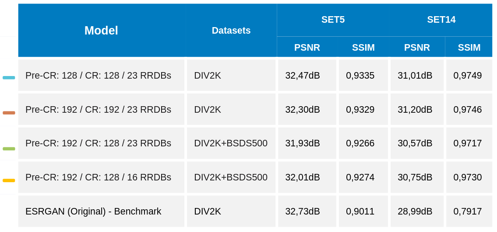

# enhanced-srgan

### Abstract

Image super-resolution (SR) is the process of recovering high-resolution (HR) images from low-resolution (LR) images.
It is an important class of image processing techniques in computer vision and image processing and has a wide range
of real-world applications, such as medical imaging, satellite imaging, surveillance and security, astronomical imaging, amongst others.

With the fast progress in deep learning techniques of the recent years, deep learning-based SR models have been actively
explored and often achieve state-of-the-art performance on various benchmarks of super-resolution tasks. A variety of 
deep learning methods have been applied to solve SR tasks, ranging from the early Convolutional Neural Networks (CNN)
based method to recent promising Generative Adversarial network-based SR approaches.

In this project we implement the Enhanced Super-Resolution Generative Adversarial Network (ESRGAN), which is capable of 
generating realistic textures when performing single image super-resolution (SISR). This implementation was introduced 
by Xintao et al. in 2018 on the paper [ESRGAN: Enhanced Super-Resolution Generative Adversarial Networks](https://arxiv.org/abs/1809.00219), 
based on the original work shown on the paper [Photo-Realistic Single Image Super-Resolution Using a Generative Adversarial Network](https://arxiv.org/pdf/1609.04802v5.pdf),
from which it implements a series of improvements to the three key components of the deep learning model: 
the network architecture, adversarial loss and perceptual loss.

### Authors: Marc Bermejo, Ferran Torres, Raul Puente

### Advisor: Dani Fojo

## Table of Contents

1. [Introduction](#1-abstract)
2. [Motivation](#2-motivation)
3. [Theory](#3-theory)
4. [Execution Instructions](#4-execution-instructions)
   1. [Installation](#41-installation)
5. [Milestones](#5-milestones)
6. [Datasets](#6-datasets)
7. [Environment](#7-environment)
8. [Architecture](#8-architecture)
    1. [Model definitions](#81-model-definitions)
    2. [Hyper-parameters](#82-hyper-parameters)
    3. [Loss functions](#83-loss-functions)
    4. [Quality Metrics](#84-quality-metrics)
    5. [Network Interpolation](#85-network-interpolation)
9. [Training process](#9-training-process)
    1. [Pre-training](#91-pre-training-step)
    2. [Training](#92-training-step)
    3. [Logging](#93-logging)
10. [Results](#10-results)
     1. [Executions](#101-executions)
     2. [Metrics](#102-metrics)
     3. [Model Results](#103-model-results)
     4. [Torch models trained](#104-torch-models-trained)
     5. [Comparison metrics](#105-comparison-metrics)
11. [Conclusions](#11-conclusions)
12. [References](#12-references)
13. [Presentation](#13-presentation)

## 1. Introduction

Single image super-resolution (SISR), as a fundamental low-level vision problem, has attracted increasing attention in 
the research community and AI companies. SISR aims at recovering a high-resolution (HR) image from a single
low-resolution (LR) one. Since the pioneer work of [SRCNN](https://arxiv.org/pdf/1501.00092.pdf) proposed by Dong et al.,
deep convolution neural network (CNN) approaches have brought prosperous development. Various network architecture
designs and training strategies have continuously improved the SR performance, especially the Peak Signal-to-Noise Ratio (PSNR) value.
However, these PSNR-oriented approaches tend to output over-smoothed results without sufficient high-frequency details,
since the PSNR metric fundamentally disagrees with the subjective evaluation of human observers.

Several perceptual-driven methods have been proposed to improve the visual quality of SR results. For instance,
[perceptual loss](https://arxiv.org/pdf/1603.08155.pdf) is proposed to optimize super-resolution model in a feature
space instead of pixel space. In a later stage, generative adversarial networks are introduced to deep learning SR models
to give the generator the ability to produce more realistic images. One of the milestones in the way to pursue more visually
pleasing results is [SRGAN](https://arxiv.org/pdf/1609.04802v5.pdf). The basic model is built with residual blocks and
optimized using perceptual loss in a GAN framework. With all these techniques, SRGAN significantly improves the overall
visual quality of reconstruction over PSNR-oriented methods.

<p align="center">
    
    <br>
    <i><b>Fig 1. Image super-resolution techniques visual quality evolution.</b></i>
</p>

To further enhance the visual quality of the images, [ESRGAN](https://arxiv.org/abs/1809.00219) architecture was introduced.
The aim of this implementation was to reduce the often generated unpleasant artifacts from the hallucinated
details created by the network. To further enhance the visual quality, Xintao et al. revisited the three key components
of SRGAN: the network architecture, adversarial loss and perceptual loss; and improved each of them to derive to an
Enhanced SRGAN (ESRGAN) network implementation.

First, they improved the network structure by introducing the novel 
Residual-in-Residual Dense Block (RRDB), which has higher capacity and is easier to train. They also removed the 
Batch Normalization (BN) layers as in [EDSR](https://arxiv.org/pdf/1707.02921.pdf), as they tend to bring artifacts 
to generated images. Another improvement to the network was to use residual scaling and smaller initialization to
facilitate training a very deep neural network. Second, they improved the discriminator by using a Relativistic average GAN ([RaGAN](https://arxiv.org/pdf/1807.00734.pdf))
model, which learns to judge “whether one image is more realistic than the other” rather than “whether one image is real or fake”.
Third, they propose an improved perceptual loss by using the VGG features before activation instead of after activation as in SRGAN.
Furthermore, in order to balance the visual quality and RMSE/PSNR, a network interpolation strategy is suggested, which
could continuously adjust the reconstruction style and smoothness.

<p align="center">
    
    <br>
    <i><b>Fig 2. Comparison of single image super-resolution between SRGAN and ESRGAN implementations.</b></i>
</p>

<p align="right"><a href="#table-of-contents">To top</a></p>

## 2. Motivation

The aim of choosing a project based on single image super-resolution was to investigate the current existing set of
deep-learning techniques because of the wide range of possible solutions to real challenges that they can provide.

Following our project advisor’s recommendations, we decided to follow the Generative Adversarial network-based SR approach,
which represented a great opportunity to learn more about this kind architectures. Training a GAN network is a nice
challenge given the complexity of having to train two different networks competing with each to outperform and fool the system. 

As mentioned previously, the idea of the project was to target a solution with potential appliance at business level.

<p align="right"><a href="#table-of-contents">To top</a></p>

## 3. Execution Instructions

### 3.1 Installation

You can install ``torch-sr`` via `pip <pip_>`_ or directly from source.

#### Install from GitHub

You can install the latest development version using [pip](https://pip.pypa.io/en/stable/) directly from the GitHub repository:

```bash
pip install git+https://github.com/AIDL-PROJ-2022/enhanced-srgan.git
```

#### Install from source

It's also possible to clone the Git repository and install it from source using [pip](https://pip.pypa.io/en/stable/):

```bash
git clone https://github.com/AIDL-PROJ-2022/enhanced-srgan.git
cd enhanced-srgan
pip3 install -r requirements.txt
```

### 3.2 ESRGAN model training

Model can be trained using the `train.py` script that can be found on the root project directory.

```
usage: train.py [-h] [-l LOAD_CHECKPOINT] [-a] [--no-data-parallel] [-i CHECKPOINT_INTERVAL] [-w BEST_CHECKPOINT_WARMUP] [-s STORE_MODEL_INTERVAL] config_file

positional arguments:
  config_file           JSON training configuration hyper-parameters

optional arguments:
  -h, --help            show this help message and exit
  -l LOAD_CHECKPOINT, --load-checkpoint LOAD_CHECKPOINT
                        Path to the training checkpoint used as the start point
  -a, --autocast        Use PyTorch autocast when running on GPU with CUDA support
  --no-data-parallel    Disable parallelization if more than one GPU is detected on the system
  -i CHECKPOINT_INTERVAL, --checkpoint-interval CHECKPOINT_INTERVAL
                        Define checkpoint store frequency. Default: 1
  -w BEST_CHECKPOINT_WARMUP, --best-checkpoint-warmup BEST_CHECKPOINT_WARMUP
                        Define a warm-up period until best checkpoint is stored. Default: 0
  -s STORE_MODEL_INTERVAL, --store-model-interval STORE_MODEL_INTERVAL
                        Define model store frequency. If not specified, model won't be stored during training.
```

By default, all model checkpoints and state dictionaries will be stored to `saved_models/` directory relative to the working directory.

#### Example

```bash
python train.py --config-json configs/esrgan_192_cr_23_rrdb_div2k.json --load-model-path saved_models/1657192860_RRDB_PSNR_x4_best_model.pth --autocast --best-checkpoint-warmup 2000 --store-model-interval 20 --checkpoint-interval 50
```

### 3.2 ESRGAN model test

Model can be tested using the `test.py` script that can be found on the root project directory.

```
usage: test.py [-h] [-d DATASETS] [-s SHOW_RESULTS] [-o OUT_DIR] model_path

positional arguments:
  model_path            ESRGAN model path to test

optional arguments:
  -h, --help            show this help message and exit
  -d DATASETS, --datasets DATASETS
                        Datasets to use to test the specified model. Datasets need to be specified sepparated by a coma.
                        Example: --datasets=set5,set14. Available values are: 'div2k', 'bsds500', 'set5', and 'set14'.
  -s SHOW_RESULTS, --show-results SHOW_RESULTS
                        Show N best PSNR of all tested images. If not specified, only metrics will be plotted to terminal.
  -o OUT_DIR, --out-dir OUT_DIR
                        Specify output directory where all results will be stored. If not specified, results won't be stored.
```

#### Example

```bash
python3 test.py --datasets=set5 --out-dir results/192_cr_23_rrdb_div2k/set5 models/192_cr_23_rrdb_div2k/RRDB_ESRGAN_x4.pth
```

### 3.3 ESRGAN model inference

Model inference can be run using the `inference.py` script that can be found on the root project directory.
When running inference, super-resolution can be applied to custom user-provided images and store the results.

```
usage: inference.py [-h] -m MODEL_PATH [-o OUT_DIR] images [images ...]

positional arguments:
  images

optional arguments:
  -h, --help            show this help message and exit
  -m MODEL_PATH, --model-path MODEL_PATH
                        Input generator model path. Can be a checkpoint or a final model.
  -o OUT_DIR, --out-dir OUT_DIR
                        Output directory where inferred images will be stored. If not specified, resultant images will 
                        be stored to the same directory from where they were found.
```

To differentiate original from super-resolved images, the `_sr` suffix will be appended to each input image name.

#### Example

```bash
python3 inference.py --model-path models/192_cr_23_rrdb_div2k/RRDB_ESRGAN_x4.pth ~/Pictures/my-fancy-picture.png
```

### 3.4 ESRGAN network interpolation

The script `net_interpolation.py` can be used to perform network interpolation as described in [Network Interpolation](#85-network-interpolation).

```
usage: net_interpolation.py [-h] --psnr-model-path PSNR_MODEL_PATH --esrgan-model-path ESRGAN_MODEL_PATH --alpha ALPHA out_model_path

positional arguments:
  out_model_path        Output interpolated model

optional arguments:
  -h, --help            show this help message and exit
  --psnr-model-path PSNR_MODEL_PATH
                        PSNR-based (pre-training) input model path.
  --esrgan-model-path ESRGAN_MODEL_PATH
                        ESRGAN-based (training) input model path.
  --alpha ALPHA         Network interpolation alpha.
```

#### Example

```bash
python3 net_interpolation.py --psnr-model-path models/128_cr_23_rrdb_div2k/RRDB_PSNR_x4.pth  models/128_cr_23_rrdb_div2k/RRDB_ESRGAN_x4.pth  --alpha 0.9 models/128_cr_23_rrdb_div2k/RRDB_ESRGAN_x4_0.9_interp.pth
```

<p align="right"><a href="#table-of-contents">To top</a></p>

## 5. Milestones

The main milestones throughout this project were:

- Project preparation.
- Dataset Preparation & Loading.
- First Model Training.
- First metrics and model training.
- Project Review and conclusions.

<p align="right"><a href="#table-of-contents">To top</a></p>

## 6. Datasets
We are using two types of datasets

- [BSDS500](https://www2.eecs.berkeley.edu/Research/Projects/CS/vision/grouping/resources.html#bsds500)
    * Standard benchmark for edge and contour detection segmentation.
    * Consists of 500 images, each with 5 different ground truth segmentations.
    * Contains:
        * 200 images for training.
        * 100 images for validation.
        * 200 images for testing.

- [DIV2K](https://data.vision.ee.ethz.ch/cvl/DIV2K)
    * Recommended for SR given the different types of degradations contained in this dataset.
    * Different upscaling and downscaling steps applied to obtain those degradations.
    * 1000 images. All with 2K resolution.
    * Contains:
        * 800 images for training.
        * 100 images for validation.
        * 100 images for testing.

- [SET5](https://deepai.org/dataset/set5-super-resolution)
    * The Set5 dataset is a dataset consisting of 5 images (“baby”, “bird”, “butterfly”, “head”, “woman”) commonly 
      used for testing performance of Image Super-Resolution models.

- [SET14](https://deepai.org/dataset/set14-super-resolution)
    * The Set14 dataset is a dataset consisting of 14 images commonly used for testing performance of Image Super-Resolution models.

<p align="right"><a href="#table-of-contents">To top</a></p>


## 7. Environment

The project has been fully implemented using Pytorch Framework. Additionally, the Albumentations library has been 
included in order to perform the crops and different transformations to the images from the Dataset.

Most of the trials have been carried out within local environment because the availability of the equipment and the 
timing constraints that the project has faced. 

* **_Raul Puente's server:_** 
  * **CPU:** Intel(R) Core(TM) i9-10900F CPU @ 2.80GHz
  * **RAM:** 64 GB
  * **GPU:** GeForce® GTX 3070 - 4 GB RAM
* **_Marc Bermejo's server:_**
  * **CPU:** AMD Ryzen™ 9 3900X @ 3.8GHz
  * **RAM:** 32 GB
  * **GPU:** GeForce® GTX 1080 Ti - 11 GB RAM

Once the project reached an acceptable level of maturity, different trainings have been performed in a Google Cloud 
environment to improve network training speed and allow more parallel trainings.

* **_Google cloud environment:_**
  * **GPU:** NVIDIA V100 GPUs 
  * **RAM:** 30 GB
  * **CPU:** 8 VIRTUAL CPU

In terms of data visualization and logging, both Wandb and Tensorboard have been included into the project given that 
W&B can support Tensorboard and each of them provides additional features. For example: Wandb allows tracking the images
created after each epoch and Tensorboard displays the model Graph for each execution.

<p align="center">
    
    <br>
    <i><b>Fig 3. Model training execution environment diagram.</b></i>
</p>

<p align="right"><a href="#table-of-contents">To top</a></p>


## 8. Architecture

We've implemented a ESRGAN model using [PyTorch](https://pytorch.org/)

### 8.1 Model definitions

<p align="center">
  
  
</p>

### 8.2 Hyper-parameters

Default hyper-parameters defined in paper

| Hyperparameters                     | Default Values                           | Comments                                                                                                                                                                                                  |
|-------------------------------------|:-----------------------------------------|-----------------------------------------------------------------------------------------------------------------------------------------------------------------------------------------------------------|
| scale_factor                        | `4`                                      | Scale factor relation between the low resolution and the high resolution images.                                                                                                                          |
| batch_size                          | `16`                                     | Data loader configured mini-batch size.                                                                                                                                                                   |
| img_channels                        | `3`                                      | Number of channels contained into the image. For RGB images this value should be 3.                                                                                                                       |
| pretraining/num_epoch               | `10000`                                  | Number of epoch needed to complete the pre-training (PSNR-driven) step.                                                                                                                                   |
| pretraining/cr_patch_size           | `[128, 128]`                             | High-resolution image crop size. Needs to be a tuple of (H, W). If set to None, any crop transform will be applied.                                                                                       |
| pretraining/lr                      | `2e-4`                                   | Configured learning rate for the pre-training step optimizer. Adam optimizer will be used for this step.                                                                                                  |
| pretraining/sched_step              | `200000`                                 | Learning rate scheduler decay rate for the pre-training step.                                                                                                                                             |
| pretraining/sched_gamma             | `0.5`                                    | Multiplicative factor of the learning rate scheduler decay for the pre-training step.                                                                                                                     |
| pretraining/train_datasets          | `["div2k"]`                              | Dataset(s) used during training of the pre-training step. Must be one of ``'div2k'``, ``'bsds500'``.                                                                                                      |
| pretraining/val_datasets            | `["bsds500"]`                            | Dataset(s) used during validation of the pre-training step. Must be one of ``'div2k'``, ``'bsds500'``.                                                                                                    |
| training/num_epoch                  | `8000`                                   | Number of epoch needed to complete the training step.                                                                                                                                                     |
| training/cr_patch_size              | `[128, 128]`                             | Number of epoch needed to complete the pre-training (GAN-driven) step.                                                                                                                                    |
| training/g_lr                       | `1e-4`                                   | Configured generator's learning rate for the training step optimizer. Adam optimizer will be used for this step.                                                                                          |
| training/d_lr                       | `1e-4`                                   | Configured discriminator's learning rate for the training step optimizer. Adam optimizer will be used for this step.                                                                                      |
| training/g_sched_steps              | `[50000, 100000, 200000, 300000]`        | List of mini-batch indices learning rate decay of the generator's training scheduler.                                                                                                                     |
| training/g_sched_gamma              | `0.5`                                    | Multiplicative factor of the generator's learning rate scheduler decay for the training step.                                                                                                             |
| training/d_sched_steps              | `[50000, 100000, 200000, 300000]`        | List of mini-batch indices learning rate decay of the discriminator's training scheduler.                                                                                                                 |
| training/d_sched_gamma              | `0.5`                                    | Multiplicative factor of the discriminator's learning rate scheduler decay for the training step.                                                                                                         |
| training/g_adversarial_loss_scaling | `0.005`                                  | Generator adversarial loss scaling factor used to calculate the total generator loss.                                                                                                                     |
| training/g_content_loss_scaling     | `0.01`                                   | Generator content loss scaling factor used to calculate the total generator loss.                                                                                                                         |
| training/train_datasets             | `["div2k"]`                              | Dataset(s) used during training of the training step. Must be one of ``'div2k'``, ``'bsds500'``.                                                                                                          |
| training/val_datasets               | `["bsds500"]`                            | Dataset(s) used during validation of the training step. Must be one of ``'div2k'``, ``'bsds500'``.                                                                                                        |
| generator/rrdb_channels             | `64`                                     | Number of channels in the residual-on-residual dense blocks latent space.                                                                                                                                 |
| generator/growth_channels           | `32`                                     | Number of channels in the residual dense block latent space.                                                                                                                                              |
| generator/num_basic_blocks          | `16`                                     | Number of basic (a.k.a residual-on-residual dense blocks) of the generator network.                                                                                                                       |
| generator/num_dense_blocks          | `3`                                      | Number of residual dense blocks contained into each RRDB block.                                                                                                                                           |
| generator/num_residual_blocks       | `5`                                      | Number of convolutional blocks contained into each residual dense block.                                                                                                                                  |
| generator/residual_scaling          | `0.2`                                    | Scaling factor applied to each skip connection defined into the generator network.                                                                                                                        |
| generator/use_subpixel_conv         | `false`                                  | If set to `True`, a Sub-Pixel convolution block will be used for up-scaling instead of the original interpolation up-scaling block.                                                                       |
| discriminator/vgg_blk_ch            | `[64, 64, 128, 128, 256, 256, 512, 512]` | Tuple containing the output channels of each convolution of the network. If two consecutive convolutions have the same output channels, a stride of two will be applied to reduce feature map dimensions. |
| discriminator/fc_features           | `[100]`                                  | Fully connected hidden layers output dimension.                                                                                                                                                           |
| content_loss/loss_f                 | `"l1"`                                   | Loss function to use to compute pixel-wise distance between images. Must be one of: ``'l1'``, ``'l2'``, ``'mse'``. Default: ``'l1'``                                                                      |
| perceptual_loss/layer_weights       | `{"conv5_4": 1.0}`                       | The weight for each layer of the VGG network used for loss calculation.                                                                                                                                   |
| perceptual_loss/vgg_type            | `"vgg19"`                                | Type of VGG network used as the perceptual loss' feature extractor. Must be one of: ``'vgg11'``, ``'vgg13'``, ``'vgg16'``, ``'vgg19'``. Default: ``'vgg19'``                                              |
| perceptual_loss/criterion           | `"l1"`                                   | Loss function to compute distance between features. Must be one of: ``'l1'``, ``'l2'``. Default: ``'l1'``                                                                                                 |
| perceptual_loss/normalize_input     | `true`                                   | If set to `True`, normalize the input image before doing inference though the VGG network. The mean and standard deviation values are calculated for an image in the range `[0, 1]`.                      |
| perceptual_loss/normalize_loss      | `false`                                  | If set to `True`, divide the total perceptual loss by the sum of the specified layers weight.                                                                                                             |

<p align="right"><a href="#table-of-contents">To top</a></p>

### 8.3 Loss functions

Whe have 3 kind of loss functions on this model.

**Content loss**<a name="content_loss"></a>: ($L_{content}$) Content loss that evaluate the 1-norm distances beween recovered image G($x_i$) and the ground-truth y. Can be configured to use the L1 (mean absolute error) or L2 (mean square error) function. By default we use L1 function.

$$
\begin{aligned}
L1 = MAE = {SAE \over N} = {1 \over N}  \sum_{t = 1}^{N} |y_t - f_t|
\end{aligned}
$$

$$
\begin{aligned}
L2 = MSE = {SSE \over N} = {1 \over N}  \sum_{t = 1}^{N} (y_t - f_t)^2
\end{aligned}
$$


**Relativistic adversarial loss**<a name="adversarial_loss"></a>: We use the relativistic GAN which tries to predict the probability that a real image $x_r$ is relatively more realistic than a fake one $x_f$, as shown in Fig.
<p align="center">
  
</p>
where σ is the sigmoid function and C(x) is the non-transformed discriminator output and E$x_f$[·] represents the operation of taking average for all fake data in the mini-batch.
The discriminator loss is then defined as: 
<br /> 

$$
\begin{aligned}
L_{D}^{Ra} = −E_{x_r} [log(D_{Ra}(x_r , x_f ))] − E_{x_f} [log(1 − D_{Ra}(x_f , x_r ))]
\end{aligned}
$$

And the adversarial los for generator is in a symmetrical form:

$$
\begin{aligned}
L_{G}^{Ra} = −E_{x_r} [log(1 − D_{Ra}(x_r, x_f ))] − E_{x_f} [log(D_{Ra}(x_f , x_r ))]
\end{aligned}
$$

where $x_f = G(x_i)$ and $x_i$ stands for the input LR image.

<br />

**Perceptual loss** ($L_{percep}$)<a name="perceptual_loss"></a>: Type of content loss introduced in the [Perceptual Losses for Real-Time Style Transfer and Super-Resolution](https://arxiv.org/abs/1603.08155v1) super-resolution and style transfer framework. Also known as VGG loss is based on the ReLU activation layers on the pre-treained 19 layer VGG netowrk.

<p align="center">
  
</p>

but with the improve by using VGG features before activation instead of after activation as in SRGAN. It was empirically found hat the adjusted perceptual loss provides sharper edges and more visually pleasing results.

<br /> 

The **total loss**<a name="total_loss"></a> ($L_G$) is then calculated by:
$L_G = L_{percep} + λL_{G}^{Ra} + ηL_{content}$ which 
λ, η are the coefficients to balance different loss terms

### 8.4 Quality Metrics

#### 8.4.1 Structural Similarity Index (SSIM)
Given 2 images, SSIM is an index with values in the range (-1,1) which estimates the level of similarity between thos two images.
* +1 = very similar or the same.
* -1 = very different.

It combines different comparison functions:
* Luminance l(x,y).
* Contrast c(x,y)
* Structure s(x,y)

Formula: **$SSIM(x,y) = [l(x,y)]^α * [c(x,y)]^β * [s(x,y)]^γ$**, where α,β,γ are the weights assigned to each feature


#### 8.4.2 Peak Signal-to-Noise (PSNR)

Ratio between maximum possible value (power) of a signal and power of distorting noise that affects the quality of its representation.

Metric used to compare different image enhancement algorithms systematically to evaluate which produces better results using the same dataset, with the Formula

$$
\begin{aligned}
PSNR = 20log_{10}({MAX_f\over\sqrt{MSE}})
\end{aligned}
$$

where MSE is the L2 loss and $MAX_f$ is the maximum existing signal value in our original “known to be good” image.

### 8.5 Network Interpolation

To remove unpleasant noise in GAN-based methods while maintain a good perceltual quality, we use Network Interpolation. That means that we first train a PSNR-oriented network $G_{PSNR}$ and then obtain a GAN-based network $G_{GAN}$. 

We interpolate all the corresponding parameters of these two networks to derive an interpolated model $G_{INTERP}$, whose parameters are: 

$$
\begin{aligned}
 θ_G^{INTERP} = (1 − α)θ_G^{PSNR} + αθ_G^{GAN}
\end{aligned}
$$

where $θ_G^{INTERP}$, $θ_G^{PSNR}$ and $θ_G^{GAN}$ are the parameters of $G_{INTERP}$, $G_{PSNR}$ and $G_{GAN}$ respectively, and α ∈ [0, 1] is the interpolation parameter.

G are the parameters of GINTERP, GPSNR and
GGAN, respectively, and α ∈ [0, 1] is the interpolation parameter.

<p align="right"><a href="#table-of-contents">To top</a></p>

## 9. Training process

Training process is composed in two main steps, pretraing (warm-up) and training.

First, before any step, we make **Image data augmentation** doing:

* Paired random crop (in train) / Paired center crop (in validation)
* Spatial transforms (probabilty of each 0.5 probability)
    * Applied for images of low resolution and high resolution
    * Flip with 0.25 probability
    * Transpose with 0.75 probability
* Hard transforms:
    * Applied only for images of low resolution
    * Compresion with 0.25 probability
    * Coarse Dropout with 0.25 probability

### 9.1 Pre-training step
* Only used the [Content loss](#content_loss) function for this step
* Only works with generator (no discriminator used)
* Adam optimizer with learning rate $2e^{-4}$ by default
* Scheduler lr_scheduler.StepLR with step 175000 by default
* Metrics logged:
  * for pretrain: content_loss
  * for validation: content_loss, perceptual_loss, PSNR, SSIM

### 9.2 Training step
In this step we train with generator and discriminator. For every mini batch we first freeze the discriminator and train the generator. When finished the mini batch then we train the discrminator and freeze the generator.
* Generator:
  * The [total loss](#total_loss) ($L_G = L_{percep} + λL_{G}^{Ra} + ηL_{content}$) function is used for this step, which use [perceptual loss](#perceptual_loss), [Relativistic adversarial loss](#adversarial_loss) and [Content loss](#content_loss) with coeficients
  * Adam optimizer with learning rate $1^{e-4}$ by default and betas=(0.9, 0.99)
  * Scheduler lr_scheduler.MultiStepLR with steps [50000, 100000, 175000, 250000]
* Discriminator:
  * The total loss is $L_G = L_{D}^{Ra}$ which is [Relativistic adversarial loss](#adversarial_loss) for discriminator
  * Adam optimizer with learning rate $1^{e-4}$ by default and betas=(0.9, 0.99)
  * Scheduler lr_scheduler.MultiStepLR with steps [50000, 100000, 175000, 250000]
* Metrics logged:
  * for training: content_loss, perceptual_loss,g_adversarial_loss,g_total_loss,d_adversarial_loss
  * for validation: content_loss, perceptual_loss, PSNR, SSIM
  
### 9.3 Logging
For logging we use [wandb](https://wandb.ai/) with tensorboard [integrated](https://docs.wandb.ai/guides/integrations/tensorboard) because we can work with both system and share all the logging information automatically to everyone and in real time. Besides we upload images with the result of the image and the ground truth to compare the results visually for every N epochs. 

<p align="right"><a href="#table-of-contents">To top</a></p>

## 10. Results

### 10.1 Executions
We have finished [4 differents executions](https://wandb.ai/markbeta/Torch-SR) with differents hyperparameters

* ESRGAN (PRE CR: 128 / CR: 128 / 23 RRDBs / DIV2K)
  * [Wandb information pretraining and training](https://wandb.ai/markbeta/Torch-SR/runs/1cxsyrdf)
  * Hyperparameters:
    * pretraining/cr_patch_size: [128, 128]
    * training/cr_patch_size: [128, 128]
    * generator/num_basic_blocks: 23
    * pretraining/train_datasets: ["div2k"]
    * training/train_datasets: ["div2k"]
* ESRGAN (PRE CR: 192 / CR: 128 / 23 RRDBs / DIV2K+BSDS500)
  * Wandb:
    * [Wandb information pretraining](https://wandb.ai/markbeta/Torch-SR/runs/oi51pjy8)
    * [Wandb information training](https://wandb.ai/markbeta/Torch-SR/runs/2m360jaa)
  * Hyperparameters:
    * pretraining/cr_patch_size: [192, 192]
    * training/cr_patch_size: [128, 128]
    * generator/num_basic_blocks: 23
    * pretraining/train_datasets: ["div2k", "bsds500"]
    * training/train_datasets: ["div2k", "bsds500"]
* ESRGAN (PRE CR: 192 / CR: 192 / 23 RRDBs / DIV2K)
  * Wandb:
    * [Wandb information pretraining](https://wandb.ai/markbeta/Torch-SR/runs/2gqchdp0)
    * [Wandb information training](https://wandb.ai/markbeta/Torch-SR/runs/2b8il8oy)
  * Hyperparameters:
    * pretraining/cr_patch_size: [192, 192]
    * training/cr_patch_size: [192, 192]
    * generator/num_basic_blocks: 23
    * pretraining/train_datasets: ["div2k"]
    * training/train_datasets: ["div2k"]
* ESRGAN (PRE CR: 192 / CR: 192 / 16 RRDBs /  DIV2K+BSDS500)
  * Hyperparameters:
    * pretraining/cr_patch_size: [192, 192]
    * training/cr_patch_size: [128, 128]
    * generator/num_basic_blocks: 16
    * pretraining/train_datasets: ["div2k", "bsds500"]
    * training/train_datasets: ["div2k", "bsds500"]

### 10.2 Metrics

#### 10.2.1 Train PSNR-driven content loss
<p align="center">
  
</p>

#### 10.2.2 Validation PSNR-driven

<p align="center">
  
  
  
  
</p>

#### 10.2.3 Train GAN-based
<p align="center">
  
  
  
  
  
</p>

#### 10.2.4 Validation GAN-based
<p align="center">
  
  
  
  
</p>

### 10.3 Model Results
* [Pre-CR: 128 / CR: 128 / 23 RRDBs / DIV2K]
<p align="center">
  
  
</p>

* [Pre-CR: 192 / CR: 192 / 23 RRDBs / DIV2K]
<p align="center">
  
  
</p>

* [Pre-CR: 192 / CR: 128 / 23 RRDBs / DIV2K+BSDS500]
<p align="center">
  
  
</p>

* [Pre-CR: 192 / CR: 128 / 16 RRDBs / DIV2K+BSDS500]
<p align="center">
  
  
</p>  

<p align="right"><a href="#table-of-contents">To top</a></p>

### 10.4 Torch Models trained

| Model                              | Download                                                                                                 | Comments                                 |
|------------------------------------|----------------------------------------------------------------------------------------------------------|------------------------------------------|
| p192_t128_cr_23_rrdb_div2k+bsds500 | [PSNR.pth](https://drive.google.com/file/d/1mzCvgD33wvXu__ZRio4i5Jh9bJCSW658/view?usp=sharing)           | PSNR model                               |
| p192_t128_cr_23_rrdb_div2k+bsds500 | [ESRGAN.pth](https://drive.google.com/file/d/1Is_CWrG1GB7Gp7mj68V5ashiVBiK9OOw/view?usp=sharing)         | ESRGAN model                             |
| p192_t128_cr_23_rrdb_div2k+bsds500 | [ESRGAN-interp.pth](https://drive.google.com/file/d/14PtG4mM0YdeA7cS3nbaMxmcXe2_Fxc3Q/view?usp=sharing)  | ESRGAN Interpolated with alpha 0.8 model |
| p192_t128_cr_16_rrdb_div2k+bsds500 | [PSNR.pth](https://drive.google.com/file/d/1cyPHrQy7tiuwB5-k1se7PI9sdWw3yrz8/view?usp=sharing)           | PSNR model                               |
| p192_t128_cr_16_rrdb_div2k+bsds500 | [ESRGAN.pth](https://drive.google.com/file/d/1cCxkpeeP-USsNbYEDKkRXNdKY1hN8CCJ/view?usp=sharing)         | ESRGAN model                             |
| p192_t128_cr_16_rrdb_div2k+bsds500 | [ESRGAN-interp.pth](https://drive.google.com/file/d/1cJgd9c6EmkKo68Dg1tD_PdZBNbQ-rfvM/view?usp=sharing)  | ESRGAN Interpolated with alpha 0.8 model |
| p192_cr_23_rrdb_div2k              | [PSNR.pth](https://drive.google.com/file/d/1o5FwomoEGLIHBIMAVXiIOlEeGQTmPI09/view?usp=sharing)           | PSNR model                               |
| p192_cr_23_rrdb_div2k              | [ESRGAN.pth](https://drive.google.com/file/d/1zZwGch8f3dIE5OVU1na1pqHRlOj-61xN/view?usp=sharing)         | ESRGAN model                             |
| p192_cr_23_rrdb_div2k              | [ESRGAN-interp.pth](https://drive.google.com/file/d/1Z3xTC4DimXQlgw2SvvXBorPzfkozCnRa/view?usp=sharing)  | ESRGAN Interpolated with alpha 0.8 model |
| 128_cr_23_rrdb_div2k               | [PSNR.pth](https://drive.google.com/file/d/13orzB4WP9uK0OBG52Ht9nsnUAwi73yKX/view?usp=sharing)           | PSNR model                               |
| 128_cr_23_rrdb_div2k               | [ESRGAN.pth](https://drive.google.com/file/d/1UL1DMT2KaHTjNNiN53v0qplliM4zHEOS/view?usp=sharing)         | ESRGAN model                             |
| 128_cr_23_rrdb_div2k               | [ESRGAN-interp.pth](https://drive.google.com/file/d/1Bj4C8j1mjoCFkjZzaY_te4KjMMIMt4WO/view?usp=sharing)  | ESRGAN Interpolated with alpha 0.8 model |

<p align="right"><a href="#table-of-contents">To top</a></p>

### 10.5 Comparison metrics

<p align="center">
  
</p>

<p align="right"><a href="#table-of-contents">To top</a></p>

## 11. Conclusions

It has been a very challenging project, and we have learned a lot. One of the first issues we faced is the hardware limitation.
It took a lot of time to train the models, and the batch and crop sizes were limited directly by the available GPU memory.

Another major issue we faced during 


<p align="right"><a href="#table-of-contents">To top</a></p>

## 12. References

[Automated visual quality inspection using AI/ML in manufacturing industries that reduces scrap/rework costs](https://industry40.co.in/automated-visual-quality-inspection-using-ai-ml-in-manufacturing/)

[An Evolution in Single Image Super Resolution using Deep Learning](https://towardsdatascience.com/an-evolution-in-single-image-super-resolution-using-deep-learning-66f0adfb2d6b)

[Enhance Image! Real-time Super Resolution with ARC EV Processor IP](https://www.synopsys.com/designware-ip/technical-bulletin/super-resolution-with-arc-ev.html)

[Image Super-Resolution by Neural Texture Transfer](https://zzutk.github.io/SRNTT-Project-Page/)

[VGG Very Deep Convolutional Networks (VGGNet) - What you need to know - viso.ai](https://viso.ai/deep-learning/vgg-very-deep-convolutional-networks/)

[HAIBAL – Importing a VGG 16 model from Keras](https://www.technologies-france.com/2022/04/09/haibal-importing-a-vgg-16-model-from-keras/)

[Latent Space in Deep Learning](https://www.baeldung.com/cs/dl-latent-space)

[A Gentle Introduction to Padding and Stride for Convolutional Neural Networks](https://machinelearningmastery.com/padding-and-stride-for-convolutional-neural-networks/
)

[Step by step VGG16 implementation in Keras for beginners](https://towardsdatascience.com/step-by-step-vgg16-implementation-in-keras-for-beginners-a833c686ae6c)

[Perceptual Discriminator Diagram explanation](https://www.researchgate.net/figure/The-perceptual-discriminator-is-composed-of-a-pre-trained-image-classification-network_fig1_327464533)

[GAN Schema](https://www.researchgate.net/figure/Architecture-of-the-generative-adversarial-network-GAN-based-method-with-corresponding_fig1_335862244)

[Content Loss](https://pytorch.org/tutorials/advanced/neural_style_tutorial.html
)

[Super Resolution GAN (SRGAN)](https://jonathan-hui.medium.com/gan-super-resolution-gan-srgan-b471da7270ec)

[Intuitive Guide to Neural Style Transfer](https://towardsdatascience.com/light-on-math-machine-learning-intuitive-guide-to-neural-style-transfer-ef88e46697ee)

[Neural style transfer](https://keras.io/examples/generative/neural_style_transfer/)

[All about Structural Similarity Index (SSIM): Theory + Code in PyTorch](https://medium.com/srm-mic/all-about-structural-similarity-index-ssim-theory-code-in-pytorch-6551b455541e)

[Peak Signal-to-Noise Ratio as an Image Quality Metric](https://www.ni.com/es-es/innovations/white-papers/11/peak-signal-to-noise-ratio-as-an-image-quality-metric.html)

<p align="right"><a href="#table-of-contents">To top</a></p>

## 13. Presentation

<p align="right"><a href="#table-of-contents">To top</a></p>
