# enhanced-srgan

Enhanced SuperRessolution using a GAN model with a residual-on-residual generator.

### Authors: Marc Bermejo, Ferran Torres, Raul Puente

### Advisor: Dani Fojo

## Table of Contents <a name="toc"></a>

1. [Introduction](#intro)
1. [Motivation](#motivation)
1. [Execution Instructions](#instructions)
1. [Milestones](#milestones)
1. [Datasets](#datasets)
1. [Environment](#environment)
1. [Architecture](#architecture)
    1. [Hyperparameters](#hyperparameters)
    1. [Loss functions](#lossfunctions)
1. [Training process](#training)
    1. [Pre-training](#pre_training_step)
    1. [Training](#training_step)
    1. [Logging](#training_logging)
1. [Results](#results)
    1. [Executions](#executions)
    1. [Metrics](#metrics)
    1. [Images](#images)
1. [Conclusions](#conclusions)
1. [References](#references)

## 1. Introduction <a name="intro"></a>

In this project we will implement the Super-Resolution Generative Adversarial Network (SRGAN) which is a seminal work that is capable of generating realistic textures during single image super-resolution. This implementation where introduced by Xintao Wang, Ke Yu, Shixiang Wu, Jinjin Gu, Yihao Liu, Chao Dong, Chen Change Loy, Yu Qiao, Xiaoou Tang in 2018 by the paper [ESRGAN: Enhanced Super-Resolution Generative Adversarial Networks](https://arxiv.org/abs/1809.00219)

<p align="right"><a href="#toc">To top</a></p>

## 2. Motivation <a name="motivation"></a>

The aim of choosing a project based on Super Resolution was to investigate this set of techniques because of the wide range of possible solutions to real challenges that they can provide. Some examples could be the resolution improvement of images coming from satellites for future analysis or the enhancement of optical inspection processes used in many sectors like Aerospace, Electronics or FMCG. 

Following our project advisor’s recommendations, the team decided to follow the GAN model run the implementation, which represented a great opportunity to learn more about this kind architectures. Training a GAN network is a nice challenge given the complexity of having to train 2 different networks competing with each to outperform and fool the system. 

As mentioned previously, the idea of the project was to target a solution with potential appliance at business level.

<p align="center">
  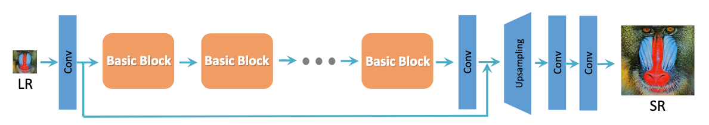
</p>
<p align="center">
  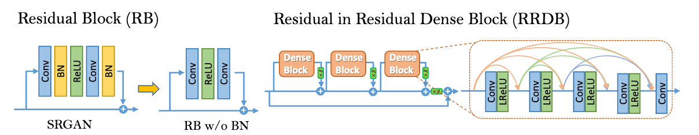
</p>

<p align="right"><a href="#toc">To top</a></p>

### Theory

The first methods that targeted an increase the resolution of an image, where based on different possible interpolation methods estimating values of the unknown pixels using the ones at their surroundings. 

Later on, the introduction of Convolutional neural networks using a Classifier and the feature extractor allowed first image-to-image mapping model for Super Resolution, the SRCNN.

Afterwards, the SRCNN inspired the creation of new architectures that included different updates and improved accuracy:
Resnet: use of skip connections.
Replacement of simple convolutions by residual blocks
Learnable Upsampling methods like Sub-Pixel convolution instead of interpolations..
   
Some time later, the introduction of the Perceptual loss, which is a mean of all MSE of each pixel (Target Real HR Image VS Output), as Loss function instead of using directly the MSE error proved to be a right choice as it reduced over-smoothing improving the perceptual quality.

And finally the transition to GANs with:
A Generator based on Resnet and Sub-Pixel Convolution that learns to create SR images and combines Perceptual Loss and Adversarial Loss inside its loss function.
A Discriminator that learns to identify if an image is real or Fake.   

<p align="center">
  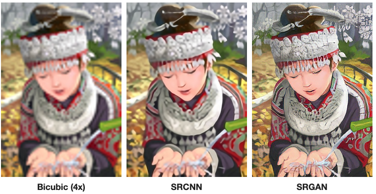
</p>

<p align="right"><a href="#toc">To top</a></p>

## 3. Execution Instructions <a name="instructions"></a>
This are the executions commands to traing, test and inference the model
### 3.1 Installation
Need to install all required packages with pip
```bash
pip install -f requirements.txt
```

### 3.2 Pretraining process execution
```bash
python train.py RPL: blah blah blah
```

<p align="right"><a href="#toc">To top</a></p>

## 4. Milestones <a name="milestones"></a>
The main milestones throughout this project were:
- Project preparation
- Dataset Preparation & Loading
- First Model Training
- First metrics and model training
- Project Review and conclusions

<p align="right"><a href="#toc">To top</a></p>

## 5. Datasets <a name="datasets"></a>
We are using two types of datasets

- [BSDS500](https://www2.eecs.berkeley.edu/Research/Projects/CS/vision/grouping/resources.html#bsds500)
    * Standard benchmark for edge and contour detection segmentation.
    * RESOLUTION?
    * Consists of 500 images, each with 5 different ground truth segmentations.
    * Contains:
        * 200 images for training.
        * 100 images for validation.
        * 200 images for testing.
- [DIV2K](https://data.vision.ee.ethz.ch/cvl/DIV2K)
    * Recommended for SR given the different types of degradations contained in this dataset.
    * Different upscaling and downscaling steps applied to obtain those degradations.
    * 1000 images. All with 2K resolution.
    * Contains:
        * 800 images for training.
        * 100 images for validation.
        * 100 images for testing.
- [SET5](https://deepai.org/dataset/set5-super-resolution)
    * The Set5 dataset is a dataset consisting of 5 images (“baby”, “bird”, “butterfly”, “head”, “woman”) commonly used for testing performance of Image Super-Resolution models.
- [SET14](https://deepai.org/dataset/set14-super-resolution)
    * The Set14 dataset is a dataset consisting of 14 images commonly used for testing performance of Image Super-Resolution models.

<p align="right"><a href="#toc">To top</a></p>

## 6. Environment <a name="environment"></a>
The project has been fully implemented using Pytorch Framework. Additionally, the Albumentations library has been included in order to perform the crops and different transformations to the images from the Dataset.

Most of the trials have been carried out within local environment because the availability of the equipment and the timing constraints that the project has faced. 

Once the project reached an acceptable level of maturity, different trainings have been performed in a Google Cloud environment parallelizing the one running locally.

In terms of data visualization and logging, both Wandb and Tensorboard have been included into the project given that W&B can support Tensorboard and each of them provides additional features. For example: Wandb allows tracking the images created after each epoch and Tensorboard displays the Graph execution.

RPL: Aqui tambien estaría bien poner capacidad de las maquinas que hemos usado en local, y también las de google cloud ademas de los tiempos que han tardado


<p align="center">
  
</p>


<p align="right"><a href="#toc">To top</a></p>

## 7. Architecture <a name="architecture"></a>

We've implemented a ESRGAN model using [PyTorch](https://pytorch.org/) RPL: blah blah blah, falta toda la teoría aqui.

### 7.1 Hyperparameters <a name="hyperparameters"></a>

Default hyperparametres defined in paper

| Hyperparameters                       | Default Values                         | Comments            |
|---------------------------------------|----------------------------------------|---------------------|
| scale_factor                          | 4                                      | RPL: blah blah blah |
| batch_size                            | 16                                     |                     |
| img_channels                          | 3                                      |                     |
| pretraining/num_epoch                 | 10000                                  |                     |
| pretraining/cr_patch_size             | [128, 128]                             |                     |
| pretraining/lr                        | 2e-4                                   |                     |
| pretraining/sched_step                | 200000                                 |                     |
| pretraining/sched_gamma               | 0.5                                    |                     |
| pretraining/train_datasets            | ["div2k"]                              |                     |
| pretraining/val_datasets              | ["bsds500"]                            |                     |
| training/num_epoch                    | 8000                                   |                     |
| training/cr_patch_size                | [128, 128]                             |                     |
| training/g_lr                         | 1e-4                                   |                     |
| training/d_lr                         | 1e-4                                   |                     |
| training/g_sched_steps                | [50000, 100000, 200000, 300000]        |                     |
| training/g_sched_gamma                | 0.5                                    |                     |
| training/d_sched_steps                | [50000, 100000, 200000, 300000]        |                     |
| training/d_sched_gamma                | 0.5                                    |                     |
| training/g_adversarial_loss_scaling   | 0.005                                  |                     |
| training/g_content_loss_scaling       | 0.01                                   |                     |
| training/train_datasets               | ["div2k"]                              |                     |
| training/val_datasets                 | ["bsds500"]                            |                     |
| generator/rrdb_channels               | 64                                     |                     |
| generator/growth_channels             | 32                                     |                     |
| generator/num_basic_blocks            | 16                                     |                     |
| generator/num_dense_blocks            | 3                                      |                     |
| generator/num_residual_blocks         | 5                                      |                     |
| generator/residual_scaling            | 0.2                                    |                     |
| generator/use_subpixel_conv           | false                                  |                     |
| discriminator/vgg_blk_ch              | [64, 64, 128, 128, 256, 256, 512, 512] |                     |
| discriminator/fc_features             | [100]                                  |                     |
| content_loss/loss_f                   | "l1"                                   |                     |
| perceptual_loss/layer_weights/conv5_4 | 1.0                                    |                     |
| perceptual_loss/normalize_input       | true                                   |                     |
| perceptual_loss/normalize_loss        | false                                  |                     |

<p align="right"><a href="#toc">To top</a></p>

### 7.2 Loss functions <a name="lossfunctions"></a>

Whe have 3 kind of loss functions on this model.

**Content loss**<a name="content_loss"></a>: ($L_{content}$) Content loss that evaluate the 1-norm distances beween recovered image G($x_i$) and the ground-truth y. Can be configured to use the L1 (mean absolute error) or L2 (mean square error) function. By default we use L1 function.

**Relativistic adversarial loss**<a name="adversarial_loss"></a>: We use the relativistic GAN which tries to predict the probability that a real image $x_r$ is relatively more realistic than a fake one $x_f$, as shown in Fig.
<p align="center">
  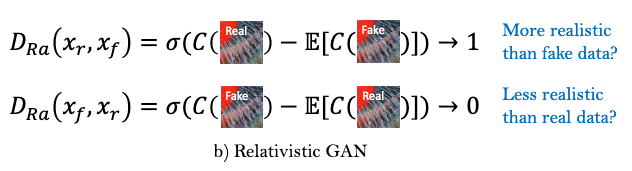
</p>
where σ is the sigmoid function and C(x) is the non-transformed discriminator output and E$x_f$[·] represents the operation of taking average for all fake data in the mini-batch.
The discriminator loss is then defined as: 
<br /> 
<br /> 

<center>

$L_{D}^{Ra} = −E_{x_r} [log(D_{Ra}(x_r , x_f ))] − E_{x_f} [log(1 − D_{Ra}(x_f , x_r ))]$

</center>

And the adversarial los for generator is in a symmetrical form:
<center>

$L_{G}^{Ra} = −E_{x_r} [log(1 − D_{Ra}(x_r, x_f ))] − E_{x_f} [log(D_{Ra}(x_f , x_r ))]$
</center>
where $x_f = G(x_i)$ and $x_i$ stands for the input LR image.

<br />
<br />

**Perceptual loss** ($L_{percep}$)<a name="perceptual_loss"></a>: Type of content loss introduced in the [Perceptual Losses for Real-Time Style Transfer and Super-Resolution](https://arxiv.org/abs/1603.08155v1) super-resolution and style transfer framework. Also known as VGG loss is based on the ReLU activation layers on the pre-treained 19 layer VGG netowrk.

<p align="center">
  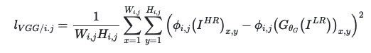
</p>

but with the improve by using VGG features before activation instead of after activation as in SRGAN. It was empirically found hat the adjusted perceptual loss provides sharper edges and more visually pleasing results.

<br /> 

The **total loss**<a name="total_loss"></a> ($L_G$) is then calculated by:
$L_G = L_{percep} + λL_{G}^{Ra} + ηL_{content}$ which 
λ, η are the coefficients to balance different loss terms

<p align="right"><a href="#toc">To top</a></p>

## 8. Training process <a name="training"></a>

Training process is composed in two main steps, pretraing (warm-up) and training.

First, before any step, we make **Image data augmentation** doing:

* Paired random crop (in train) / Paired center crop (in validation)
* Spatial transforms (probabilty of each 0.5 probability)
    * Flip with 0.25 probability
    * Transpose with 0.75 probability
* Hard transforms:
    * Compresion with 0.25 probability
    * Coarse Dropout with 0.25 probability

### 8.1 Pre-training step <a name="pre_training_step"></a>
* Only used the [Content loss](#content_loss) function for this step
* Only works with generator (no discriminator used)
* Adam optimizer with learning rate $2e^{-4}$ by default
* Scheduler lr_scheduler.StepLR with step 175000 by default
* Metrics logged:
  * for pretrain: content_loss
  * for validation: content_loss, perceptual_loss, PSNR, SSIM

### 8.2 Training step <a name="training_step"></a>
In this step we train with generator and discriminator. For every mini batch we first freeze the discriminator and train the generator. When finished the mini batch then we train the discrminator and freeze the generator.
* Generator:
  * The [total loss](#total_loss) ($L_G = L_{percep} + λL_{G}^{Ra} + ηL_{content}$) function is used for this step, which use [perceptual loss](#perceptual_loss), [Relativistic adversarial loss](#adversarial_loss) and [Content loss](#content_loss) with coeficients
  * Adam optimizer with learning rate $1^{e-4}$ by default and betas=(0.9, 0.99)
  * Scheduler lr_scheduler.MultiStepLR with steps [50000, 100000, 175000, 250000]
* Discriminator:
  * The total loss is $L_G = L_{D}^{Ra}$ which is [Relativistic adversarial loss](#adversarial_loss) for discriminator
  * Adam optimizer with learning rate $1^{e-4}$ by default and betas=(0.9, 0.99)
  * Scheduler lr_scheduler.MultiStepLR with steps [50000, 100000, 175000, 250000]
* Metrics logged:
  * for training: content_loss, perceptual_loss,g_adversarial_loss,g_total_loss,d_adversarial_loss
  * for validation: content_loss, perceptual_loss, PSNR, SSIM
  
### 8.3 Logging <a name="training_logging"></a>
For logging we use [wandb](https://wandb.ai/) with tensorboard [integrated](https://docs.wandb.ai/guides/integrations/tensorboard) because we can work with both system and share all the logging information automatically to everyone and in real time. Besides we upload images with the result of the image and the ground truth to compare the results visually for every N epochs. 

<p align="right"><a href="#toc">To top</a></p>

## 9. Results <a name="results"></a>

### 9.1 Executions <a name="executions"></a>
We have finished [4 differents executions](https://wandb.ai/markbeta/Torch-SR) with differents hyperparameters

* ESRGAN (PRE CR: 128 / CR: 128 / 23 RRDBs / DIV2K)
  * [Wandb information pretraining and training](https://wandb.ai/markbeta/Torch-SR/runs/1cxsyrdf)
  * Hyperparameters:
    * pretraining/cr_patch_size: [128, 128]
    * training/cr_patch_size: [128, 128]
    * generator/num_basic_blocks: 23
    * pretraining/train_datasets: ["div2k"]
    * training/train_datasets: ["div2k"]
* ESRGAN (PRE CR: 192 / CR: 128 / 23 RRDBs / DIV2K+BSDS500)
  * Wandb:
    * [Wandb information pretraining](https://wandb.ai/markbeta/Torch-SR/runs/oi51pjy8)
    * [Wandb information training](https://wandb.ai/markbeta/Torch-SR/runs/2m360jaa)
  * Hyperparameters:
    * pretraining/cr_patch_size: [192, 192]
    * training/cr_patch_size: [128, 128]
    * generator/num_basic_blocks: 23
    * pretraining/train_datasets: ["div2k", "bsds500"]
    * training/train_datasets: ["div2k", "bsds500"]
* ESRGAN (PRE CR: 192 / CR: 192 / 23 RRDBs / DIV2K)
  * Wandb:
    * [Wandb information pretraining](https://wandb.ai/markbeta/Torch-SR/runs/2gqchdp0)
    * [Wandb information training](https://wandb.ai/markbeta/Torch-SR/runs/2b8il8oy)
  * Hyperparameters:
    * pretraining/cr_patch_size: [192, 192]
    * training/cr_patch_size: [192, 192]
    * generator/num_basic_blocks: 23
    * pretraining/train_datasets: ["div2k"]
    * training/train_datasets: ["div2k"]
* ESRGAN (PRE CR: 192 / CR: 192 / 16 RRDBs /  DIV2K+BSDS500)
  * Hyperparameters:
    * pretraining/cr_patch_size: [192, 192]
    * training/cr_patch_size: [128, 128]
    * generator/num_basic_blocks: 16
    * pretraining/train_datasets: ["div2k", "bsds500"]
    * training/train_datasets: ["div2k", "bsds500"]

### 9.2 Metrics <a name="metrics"></a>

#### 9.2.1 Train PSNR-driven content loss
<p align="center">
  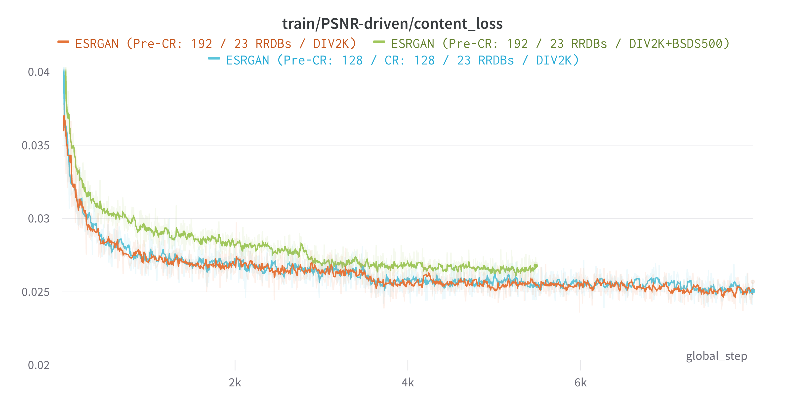
</p>

#### 9.2.2 Validation PSNR-driven
<p align="center">
  
  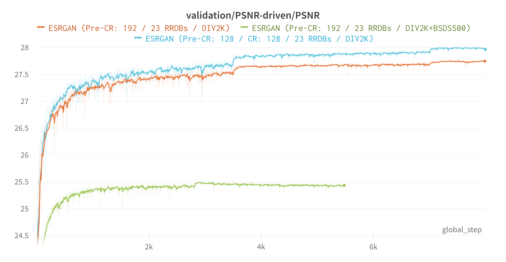
  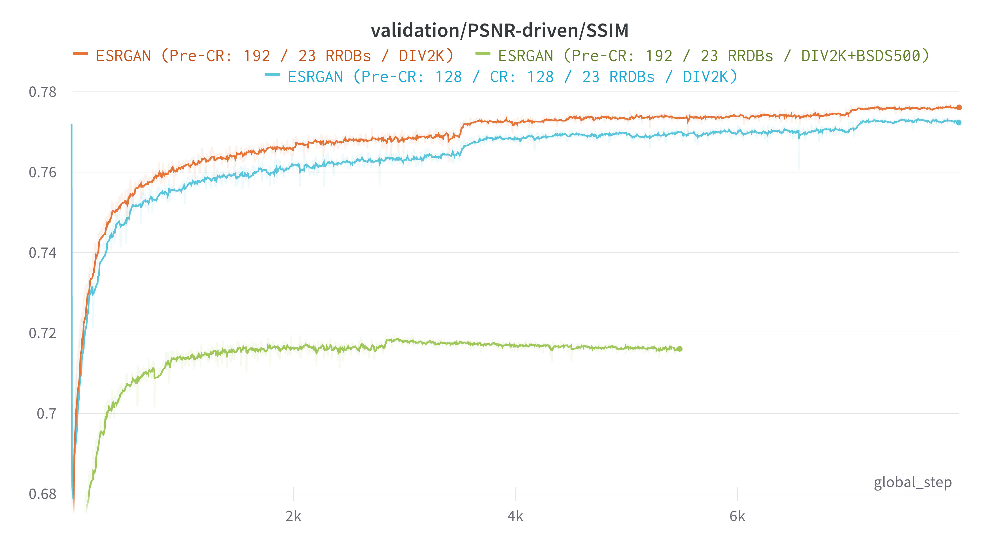
  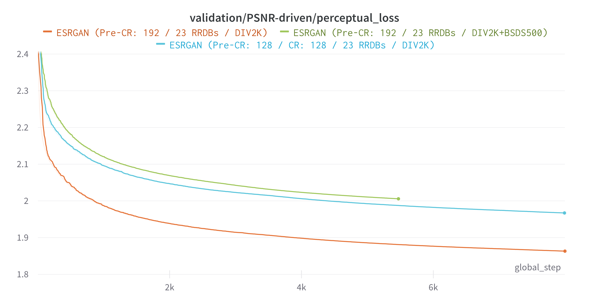
</p>

#### 9.2.3 Train GAN-based
<p align="center">
  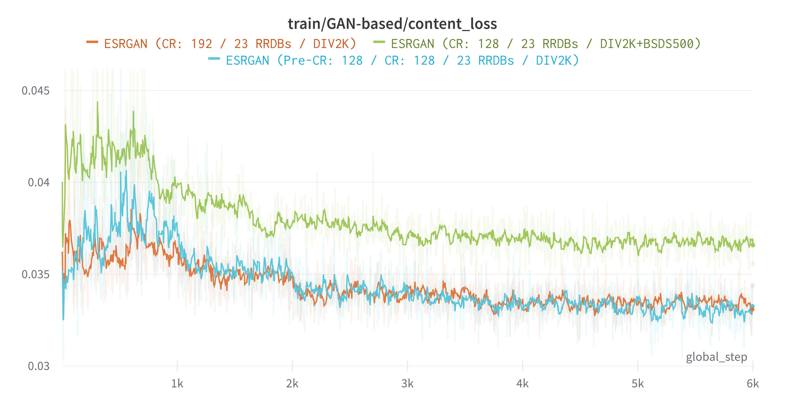
  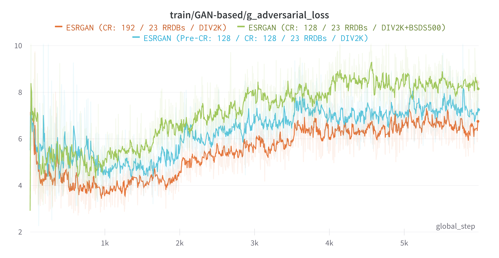
  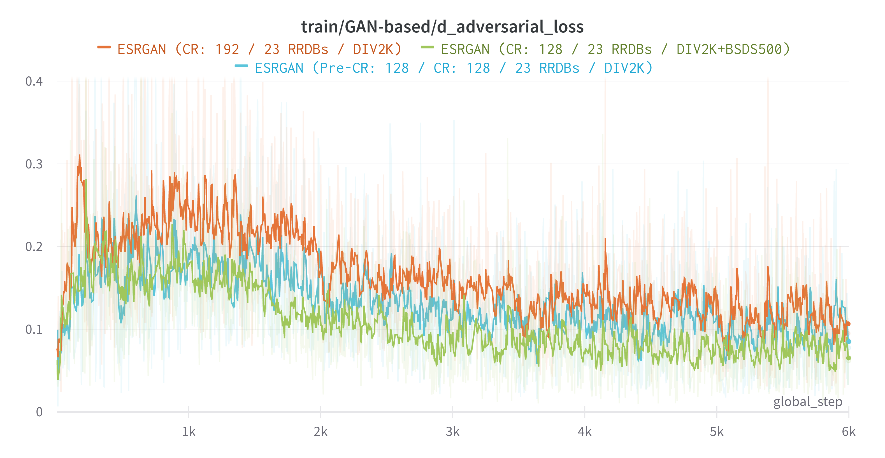
  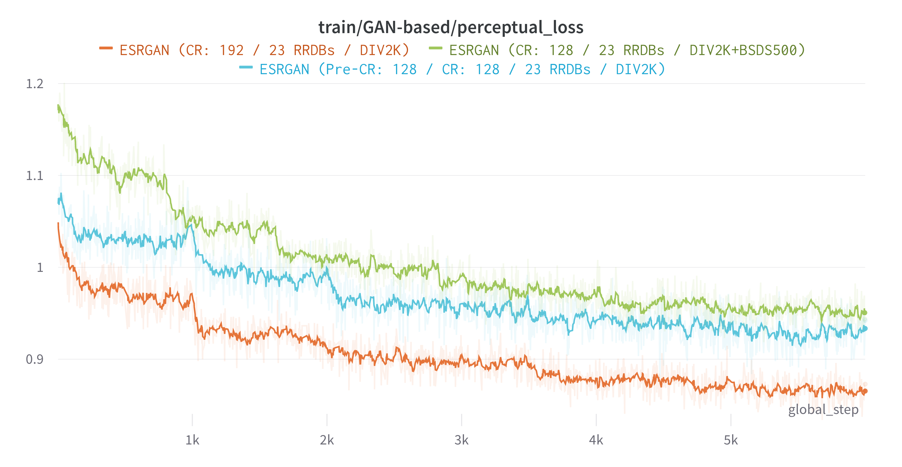
  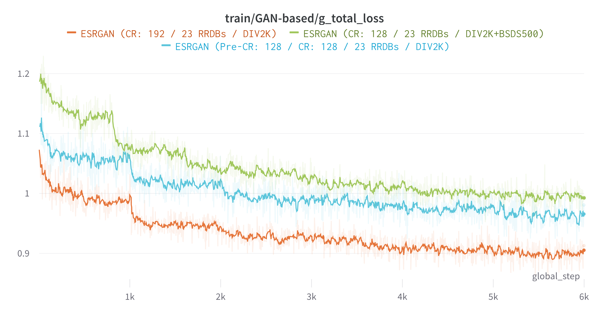
</p>

#### 9.2.4 Validation GAN-based
<p align="center">
  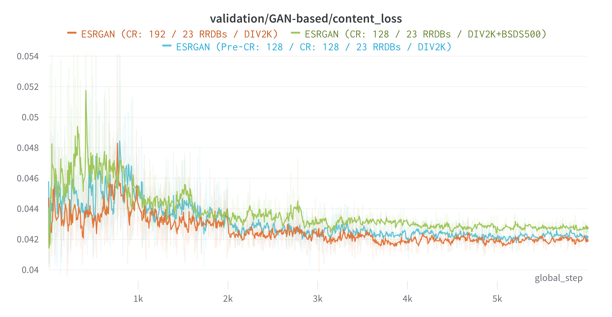
  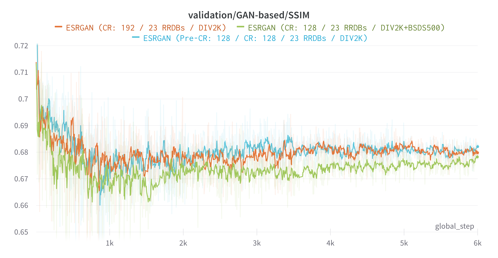
  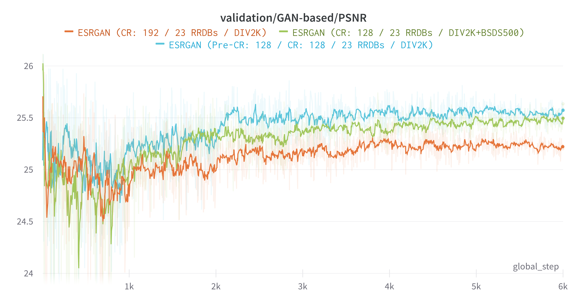
  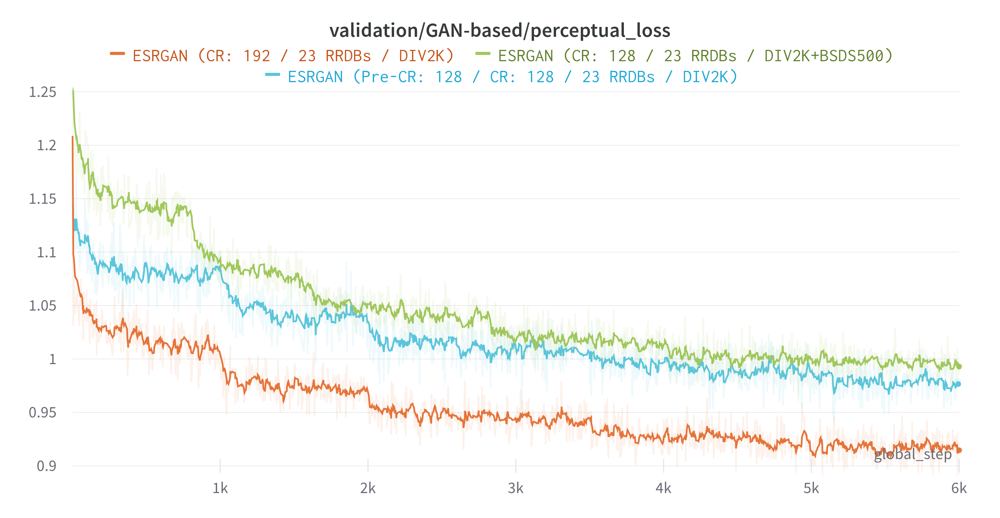
</p>

### 9.2 Images <a name="images"></a>

### 9.3 Torch Models trained <a name="models"></a>

| Model                              | Download                                                                                                 | Comments                                 |
|------------------------------------|----------------------------------------------------------------------------------------------------------|------------------------------------------|
| p192_t128_cr_23_rrdb_div2k+bsds500 | [PSNR.pth](https://drive.google.com/file/d/1mzCvgD33wvXu__ZRio4i5Jh9bJCSW658/view?usp=sharing)           | PSNR model                               |
| p192_t128_cr_23_rrdb_div2k+bsds500 | [ESRGAN.pth](https://drive.google.com/file/d/1Is_CWrG1GB7Gp7mj68V5ashiVBiK9OOw/view?usp=sharing)         | ESRGAN model                             |
| p192_t128_cr_23_rrdb_div2k+bsds500 | [ESRGAN-interp.pth](https://drive.google.com/file/d/14PtG4mM0YdeA7cS3nbaMxmcXe2_Fxc3Q/view?usp=sharing)  | ESRGAN Interpolated with alpha 0.8 model |
| p192_t128_cr_16_rrdb_div2k+bsds500 | [PSNR.pth](https://drive.google.com/file/d/1cyPHrQy7tiuwB5-k1se7PI9sdWw3yrz8/view?usp=sharing)           | PSNR model                               |
| p192_t128_cr_16_rrdb_div2k+bsds500 | [ESRGAN.pth](https://drive.google.com/file/d/1cCxkpeeP-USsNbYEDKkRXNdKY1hN8CCJ/view?usp=sharing)         | ESRGAN model                             |
| p192_t128_cr_16_rrdb_div2k+bsds500 | [ESRGAN-interp.pth](https://drive.google.com/file/d/1cJgd9c6EmkKo68Dg1tD_PdZBNbQ-rfvM/view?usp=sharing)  | ESRGAN Interpolated with alpha 0.8 model |
| p192_cr_23_rrdb_div2k              | [PSNR.pth](https://drive.google.com/file/d/1o5FwomoEGLIHBIMAVXiIOlEeGQTmPI09/view?usp=sharing)           | PSNR model                               |
| p192_cr_23_rrdb_div2k              | [ESRGAN.pth](https://drive.google.com/file/d/1zZwGch8f3dIE5OVU1na1pqHRlOj-61xN/view?usp=sharing)         | ESRGAN model                             |
| p192_cr_23_rrdb_div2k              | [ESRGAN-interp.pth](https://drive.google.com/file/d/1Z3xTC4DimXQlgw2SvvXBorPzfkozCnRa/view?usp=sharing)  | ESRGAN Interpolated with alpha 0.8 model |
| 128_cr_23_rrdb_div2k               | [PSNR.pth](https://drive.google.com/file/d/13orzB4WP9uK0OBG52Ht9nsnUAwi73yKX/view?usp=sharing)           | PSNR model                               |
| 128_cr_23_rrdb_div2k               | [ESRGAN.pth](https://drive.google.com/file/d/1UL1DMT2KaHTjNNiN53v0qplliM4zHEOS/view?usp=sharing)         | ESRGAN model                             |
| 128_cr_23_rrdb_div2k               | [ESRGAN-interp.pth](https://drive.google.com/file/d/1Bj4C8j1mjoCFkjZzaY_te4KjMMIMt4WO/view?usp=sharing)  | ESRGAN Interpolated with alpha 0.8 model |


<p align="right"><a href="#toc">To top</a></p>

## 10. Conclusions <a name="conclusions"></a>

It has been a very challenging project and we have learned a lot. One of the first issues we faced is the hardware limitation. It took a lot of time to train the models, and the batch size was also limited to the hardware compute power.

We have observed that in PPO with A2C the models were training successfully in simple environments, but when complexity was increased (Atari) we needed more episodes and we didn't get a model avble to solve the environments. This was solved using the environments frames (images) instead of the RAM as input data. Using this approach we observed that training finishes for less episodes in Pong and Space Invaders, but for Breakout the model is not able to finish the game. We suspect that this could be overfitting, and a way to solve that could be increasing the batch size, but this takes us back to the hardware limitation.

We have seen that it is very important to monitor the performance of the models with tools like TensorBoard. All the tests we made took us to other monitoring techniques like observing how each hyperparameter affected the result. Both monitoring and testing different techniques led us to the final algorithm, with which we would be able to train models able to solve Atari environments.

During this project we have had the opportunity of learning how to implement Reinforcement Learning algorithms gradually, starting with Vanilla Policy Gradients, then Advantage Actor Critic and finallty PPO, being able to train models that are able to solve different Atari games. It has been very challenging, specially with PPO, as there are a lot of factors that have to be taken into account :hyperparameters, different architectures, read different papers in order to learn techniques that could improve the performance of our model...

Deep learning has a huge community behind it, which makes it easier to find a solution to your problem. However, bulding deep learning models can lead you to a very specific problem to your case and it won't be that easy to solve it.

<p align="right"><a href="#toc">To top</a></p>

## 11. References <a name="references"></a>


[Learning from the memory of Atari 2600](https://arxiv.org/pdf/1605.01335.pdf)

[High-dimensional Continuous Control Using Generalized Advantage Estimation](https://arxiv.org/pdf/1506.02438.pdf)

[What Matters In On-Policy Reinforcement Learning? A Large-Scale Empirical Study](https://arxiv.org/pdf/2006.05990.pdf)

[Stabilizing Transformers For Reinforcement Learning](https://arxiv.org/pdf/1910.06764.pdf)

[RL — Proximal Policy Optimization (PPO) Explained | by Jonathan Hui](https://medium.com/@jonathan_hui/rl-proximal-policy-optimization-ppo-explained-77f014ec3f12)

[A (Long) Peek into Reinforcement Learning](https://lilianweng.github.io/lil-log/2018/02/19/a-long-peek-into-reinforcement-learning.html)

[Proximal Policy Optimization Algorithms](https://arxiv.org/pdf/1707.06347.pdf)

[Proximal Policy Optimization](https://openai.com/blog/openai-baselines-ppo/)

[Proximal Policy Optimization (PPO)](https://towardsdatascience.com/proximal-policy-optimization-ppo-with-tensorflow-2-x-89c9430ecc26)

[RL — Proximal Policy Optimization (PPO) Explained](https://medium.com/@jonathan_hui/rl-proximal-policy-optimization-ppo-explained-77f014ec3f12)

[Understanding Actor Critic Methods and A2C](https://towardsdatascience.com/understanding-actor-critic-methods-931b97b6df3f)

[Cartpole - Introduction to Reinforcement Learning (DQN - Deep Q-Learning)](https://towardsdatascience.com/cartpole-introduction-to-reinforcement-learning-ed0eb5b58288)

[Docs » Proximal Policy Optimization](https://spinningup.openai.com/en/latest/algorithms/ppo.html#documentation-pytorch-version)

[RL — Policy Gradient Explained](https://medium.com/@jonathan_hui/rl-policy-gradients-explained-9b13b688b146)

[RL — Policy Gradients Explained (Part 2)](https://medium.com/@jonathan_hui/rl-policy-gradients-explained-advanced-topic-20c2b81a9a8b)

[Asynchronous Methods for Deep Reinforcement Learning](https://arxiv.org/pdf/1602.01783.pdf)

[Reinforcement learning algorithms with Generalized Advantage Estimation](https://github.com/bsivanantham/GAE)

[Proximal Policy Optimization Tutorial (Part 1/2: Actor-Critic Method)](https://towardsdatascience.com/proximal-policy-optimization-tutorial-part-1-actor-critic-method-d53f9afffbf6)

[Proximal Policy Optimization Tutorial (Part 2/2: GAE and PPO loss)](https://towardsdatascience.com/proximal-policy-optimization-tutorial-part-2-2-gae-and-ppo-loss-fe1b3c5549e8)

[Applications of Reinforcement Learning in Real World](https://towardsdatascience.com/applications-of-reinforcement-learning-in-real-world-1a94955bcd12)

[Human-level control through deep reinforcement learning](https://storage.googleapis.com/deepmind-media/dqn/DQNNaturePaper.pdf)

[Playing Atari with Deep Reinforcement Learning](https://deepmind.com/research/publications/playing-atari-deep-reinforcement-learning)

[UC Berkeley Reward-Free RL Beats SOTA Reward-Based RL](https://syncedreview-com.cdn.ampproject.org/v/s/syncedreview.com/2020/09/21/uc-berkeley-reward-free-rl-beats-sota-reward-based-rl/amp/?usqp=mq331AQFKAGwASA%3D&amp_js_v=01#referrer=https%3A%2F%2Fwww.google.com&amp_tf=De%20%251%24s&ampshare=https%3A%2F%2Fsyncedreview.com%2F2020%2F09%2F21%2Fuc-berkeley-reward-free-rl-beats-sota-reward-based-rl%2F)

[From 0 to 200 - lessons learned from solving Atari Breakout with Reinforcement Learning](http://blog.jzhanson.com/blog/rl/project/2018/05/28/breakout.html)

[ACCELERATED METHODS FOR DEEP REINFORCEMENT LEARNING](https://arxiv.org/pdf/1803.02811.pdf)

## Presentation

[Presentation (PPTX 2020-9-29)](/presentation/aidl_presentation_breakout.pptx)

[Presentation (PDF 2020-9-29)](/presentation/aidl_presentation_breakout.pdf)

[Presentation (latest)](https://docs.google.com/presentation/d/15Fdu86SqXk07pGEvxz5FZPpUEyuPUffezvqd6eWLsdA/edit#slide=id.p)


<p align="right"><a href="#toc">To top</a></p>